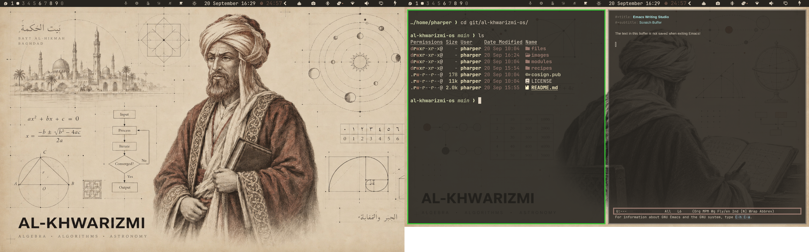

# al-khwarizmi-os &nbsp; [](https://github.com/pauljamesharper/al-khwarizmi-os/actions/workflows/build.yml)



Named in honor of [Muhammad ibn Musa al-Khwarizmi](https://en.wikipedia.org/wiki/Al-Khwarizmi), the 9th-century Persian polymath whose name gave us the word *algorithm*.

A personal, immutable Fedora Sway Atomic image with a [Hyprland](https://hyprland.org) desktop based on [Omarchy](https://omarchy.org) (DHH's Hyprland desktop), by way of my own [fedarchy](https://github.com/pauljamesharper/fedarchy) fork — baked directly into the OS image with [BlueBuild](https://blue-build.org) rather than layered on at runtime.

## Installation

**Recommended path: install stock Fedora Sway Atomic, then rebase to this image.**

1. Install plain [Fedora Sway Atomic](https://fedoraproject.org/atomic-desktops/sway/) on the machine as normal, using Fedora's own official install media. This handles disk partitioning, encryption, user account creation, timezone, etc. — none of that is this recipe's concern.
2. Rebase to this image (see below).
3. Reboot into the desktop. First-login setup runs automatically from there — see [First login](#first-login) below.

This is the primary, tested install path for this project — not the ISO route (see [ISO](#iso)), which exists mainly for machines with no way to get a Fedora Atomic base installed first. Rebasing is also far cheaper to iterate on while the recipe is still changing: it's `rpm-ostree rebase` + reboot on hardware you already have running, not a multi-GB image rebuild and a USB re-flash every time.

> [!WARNING]  
> [This is an experimental feature](https://www.fedoraproject.org/wiki/Changes/OstreeNativeContainerStable), try at your own discretion.

To rebase an existing atomic Fedora installation to the latest build:

- First rebase to the unsigned image, to get the proper signing keys and policies installed:
  ```
  rpm-ostree rebase ostree-unverified-registry:ghcr.io/pauljamesharper/al-khwarizmi-os:latest
  ```
- Reboot to complete the rebase:
  ```
  systemctl reboot
  ```
- Then rebase to the signed image, like so:
  ```
  rpm-ostree rebase ostree-image-signed:docker://ghcr.io/pauljamesharper/al-khwarizmi-os:latest
  ```
- Reboot again to complete the installation
  ```
  systemctl reboot
  ```

The `latest` tag will automatically point to the latest build. That build will still always use the Fedora version specified in `recipe.yml`, so you won't get accidentally updated to the next major version.

## First login

The image bakes in the Hyprland/fedarchy desktop and every system package, but deliberately leaves personal, per-user setup (dotfiles, Homebrew, the CLI tool set) for first login instead — that's fundamentally per-`$HOME` state, not something that belongs in an OSTree commit.

On the very first graphical login, `al-khwarizmi-first-run.service` (a `systemd --user` unit, pre-enabled for every user, gated on `graphical-session.target`) automatically:

1. Clones the dotfiles repo vendored into the image (`/usr/share/al-khwarizmi-os/dotfiles`, no network needed for this step) into `~/dotfiles`, then repoints its `origin` remote at the real Codeberg URL so `git pull`/`push` just work afterward.
2. Opens a terminal window and, inside it: bootstraps Homebrew if it isn't already present (needed because `install.sh` hard-requires `stow`, which this system gets from Homebrew, not `dnf`), then runs `~/dotfiles/install.sh` interactively.

It's a **visible foreground terminal, not a silent background job**, on purpose: `install.sh` has several interactive prompts (optional toolbox creation, TeX Live, battery thresholds, etc.), so this is the same experience as running it by hand, just triggered automatically instead of something you have to remember to do.

This only ever runs once — it's gated on a stamp file (`~/.local/state/al-khwarizmi-os/first-run-done`), written after the terminal window closes regardless of whether `install.sh` fully completed. `install.sh` itself is idempotent, so re-running it any time by hand (`~/dotfiles/install.sh`) is always safe — closing the window early just means you do that instead of it having finished automatically.

If the vendored dotfiles copy is ever missing (e.g. a stripped-down variant of this image), the unit quietly no-ops via `ConditionPathExists` rather than failing — the desktop works fine either way, you just don't get the personal layer.

## ISO

Alternative to rebasing, mainly useful for a machine with no existing Fedora Atomic install to rebase from. If built on Fedora Atomic, you can generate an offline installer ISO with the instructions available [here](https://blue-build.org/how-to/generate-iso/#_top). Expect it to be large — this recipe's package set (Hyprland desktop, dev toolchains, KVM/libvirt, VPN clients) puts it in the neighborhood of 4-6 GB uncompressed-to-squashfs, on top of which Flatpaks are not embedded by default (they'd need a separate `FLATPAK_REMOTE_REFS` opt-in in the ISO builder config, not currently set up here) — so first login still needs network for those regardless of install method. These ISOs cannot unfortunately be distributed on GitHub for free due to large sizes, so for public projects something else has to be used for hosting.

## Verification

These images are signed with [Sigstore](https://www.sigstore.dev/)'s [cosign](https://github.com/sigstore/cosign). You can verify the signature by downloading the `cosign.pub` file from this repo and running the following command:

```bash
cosign verify --key cosign.pub ghcr.io/pauljamesharper/al-khwarizmi-os
```
