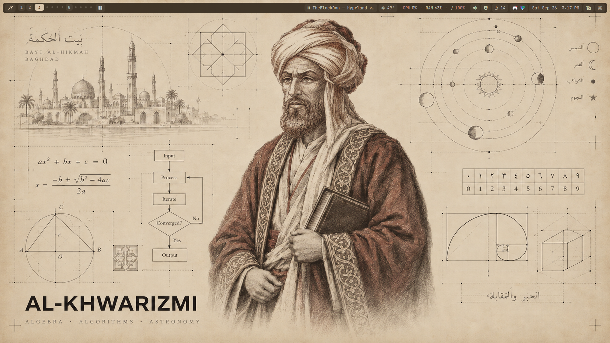
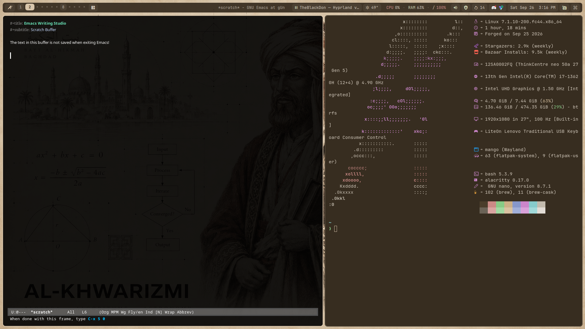

# al-khwarizmi-os &nbsp; [](https://github.com/pauljamesharper/al-khwarizmi-os/actions/workflows/build.yml)





A personal, immutable desktop image: [Aurora-DX](https://getaurora.dev) with
KDE Plasma taken out and the [mango](https://github.com/DreamMaoMao/mangowc)
Wayland compositor put in, a [Quickshell](https://quickshell.org) bar, SDDM
as the login screen, and my switchable "desk" colour themes. Built with
[BlueBuild](https://blue-build.org), so a new laptop gets the whole setup by
rebasing to one image instead of running an installer.

## Who al-Khwarizmi was

Muhammad ibn Musa al-Khwarizmi (c. 780 – c. 850) was a Persian mathematician,
astronomer and geographer who worked at the House of Wisdom (Bayt al-Hikmah)
in Baghdad, the Abbasid capital's library and centre of scholarship.

- His book *al-Kitab al-mukhtasar fi hisab al-jabr wal-muqabala* ("The
  Compendious Book on Calculation by Completion and Balancing") set out
  systematic methods for solving linear and quadratic equations. *Al-jabr*
  in its title became our word **algebra**.
- His treatise on calculating with Hindu numerals brought the decimal
  place-value system, zero included, to the Islamic world and, in Latin
  translation, to Europe. Those translations opened with *"Dixit Algorizmi"*
  ("so said al-Khwarizmi"), and his Latinised name became the word
  **algorithm**.
- He also compiled astronomical tables (a *zij*) and revised Ptolemy's
  geography with coordinates for more than two thousand places.

The wallpaper, from the Giants set of dhh's [Omarchy](https://omarchy.org),
gathers these: the House of Wisdom, the quadratic formula, an iterate-until-
converged flowchart, the Arabic and Western numerals side by side, and the
planets. A system made of algorithms seemed a fitting thing to name after him.

## What's in the image

On top of everything Aurora-DX already ships (Docker/Podman, KVM/libvirt,
VS Code, Homebrew, `ujust`, daily Universal Blue updates):

- **Removed:** all of KDE Plasma, 85 packages (the full list is in
  [`recipes/recipe.yml`](recipes/recipe.yml)). Kept: Dolphin, Ark, KDE
  Connect, KWallet and the KDE polkit agent.
- **Desktop:** mango, awww (wallpapers), quickshell, dunst, rofi, swayidle +
  swaylock, grim/slurp, cliphist, wlsunset, brightnessctl and the wlroots
  portal. mango and awww come from [Terra](https://terra.fyralabs.com), limited
  to just those two packages.
- **Login:** SDDM, running the "desk" theme from my dotfiles with the Giants
  *Turing – von Neumann* picture.
- **Apps:** Alacritty, Emacs (pgtk), imv, and Flatpaks: Discord,
  OBS, GIMP, Slack, Spotify, KeePassXC, Telegram, pavucontrol, Proton VPN.
- **Dotfiles:** a copy of my
  [dotfiles](https://codeberg.org/gluesniffmonkey/dotfiles/src/branch/mangowm)
  (`mangowm` branch), vendored at build time for the first login.

## Installing on a new machine: rebase

**Install stock Aurora-DX, then rebase to this image.**

1. Install [Aurora-DX](https://getaurora.dev) as normal, from its own ISO.
   That handles partitioning, encryption, your user account and so on. Any
   other Fedora Atomic install works as a starting point too (Bluefin,
   Kinoite, Silverblue, Sway Atomic), because a rebase replaces the whole OS
   image.
2. If you've layered packages or removed base packages on that install (for
   example by running the dotfiles' `aurora/setup.sh`), drop them first. The
   image already has them, and leftover overrides can make the rebase fail:
   ```bash
   rpm-ostree reset
   ```
3. Rebase to the unsigned image first, so the image's signing key and policy
   get installed:
   ```bash
   rpm-ostree rebase ostree-unverified-registry:ghcr.io/pauljamesharper/al-khwarizmi-os:latest
   systemctl reboot
   ```
4. Then rebase to the signed image, and reboot again:
   ```bash
   rpm-ostree rebase ostree-image-signed:docker://ghcr.io/pauljamesharper/al-khwarizmi-os:latest
   systemctl reboot
   ```
5. Sign in to **Mango** at the SDDM screen. The first-login setup opens by
   itself (below).

`latest` always points at the newest build. The image follows Aurora-DX's
`stable` channel and rebuilds daily, and `rpm-ostree upgrade` (or Aurora's
automatic updates) picks it up. To go back, pick the previous entry in the
boot menu, run `rpm-ostree rollback`, or rebase to
`ostree-image-signed:docker://ghcr.io/ublue-os/aurora-dx:stable`.

> [!WARNING]
> Rebasing between container images is still
> [marked experimental](https://www.fedoraproject.org/wiki/Changes/OstreeNativeContainerStable)
> by Fedora. Keep the previous deployment (it's in the boot menu) until the
> new one has booted cleanly.

## First login

The image carries the desktop and every system package. Per-user setup
(dotfiles, Homebrew, CLI tools, themes) is per-`$HOME` state, so it runs at
first login instead of living in the OSTree commit.

On the first graphical login, `al-khwarizmi-first-run.service` (a `systemd
--user` unit enabled for every user, started with `graphical-session.target`):

1. Clones the vendored dotfiles (`/usr/share/al-khwarizmi-os/dotfiles`, no
   network needed) into `~/dotfiles` on the `mangowm` branch, and points
   `origin` at Codeberg so `git pull` and `push` work.
2. Opens an Alacritty window running the per-user steps of
   `~/dotfiles/aurora/setup.sh`: `brew fonts stow session mise pim themes
   wallpapers apps kvm swap hibernate`. It asks for your password for the
   `sudo` parts (the swapfile, hibernation's kernel arguments, the libvirt
   group).

When it finishes, log out and back in (`Super+Shift+Q`) and you're on the
full setup: the Giants theme, the bar, and `Super+/` for the key cheat sheet.

It runs once, gated on `~/.local/state/al-khwarizmi-os/first-run-done`. If
there was no terminal to show it in, it tries again at the next login.
`setup.sh` is idempotent, so running `~/dotfiles/aurora/setup.sh` by hand at
any time is safe. Secrets still need doing by hand once: see the dotfiles
README's "By hand, once" section (`pass`, EteSync, vdirsyncer).

**Hibernation** needs Secure Boot off: Fedora's kernel disables it while
Secure Boot is on, and the power menu (`Super+X`) only offers Hibernate when
the kernel allows it.

## ISO

An alternative to rebasing, mainly for a machine with no Fedora Atomic
install to start from. You can generate an offline installer ISO with
[BlueBuild's instructions](https://blue-build.org/how-to/generate-iso/#_top).
Expect several GB, and Flatpaks aren't embedded by default, so the first
login still needs a network connection. GitHub can't host ISOs that size
for free.

## Building

GitHub Actions builds the image daily and on every push
([`.github/workflows/build.yml`](.github/workflows/build.yml)), from
[`recipes/recipe.yml`](recipes/recipe.yml):

- `files/system/`: repo files and signing keys (Terra), the
  SDDM login fix, and the first-run unit and script.
- `files/scripts/vendor-dotfiles.sh`: clones the dotfiles into the image.
- `files/scripts/desk-greeter.sh`: installs the SDDM "desk" theme from them.

The Plasma removal list mirrors `AURORA_REMOVE` in the dotfiles'
`aurora/setup.sh`; change both together.

## Verification

These images are signed with [Sigstore](https://www.sigstore.dev/)'s [cosign](https://github.com/sigstore/cosign). You can verify the signature by downloading the `cosign.pub` file from this repo and running the following command:

```bash
cosign verify --key cosign.pub ghcr.io/pauljamesharper/al-khwarizmi-os
```

## Thanks

- [Universal Blue](https://universal-blue.org) for Aurora, and
  [BlueBuild](https://blue-build.org) for making custom images this easy.
- Drew of [JustAGuy Linux](https://www.youtube.com/@JustAGuyLinux), whose
  mangowc-setup the mango session is ported from.
- [DreamMaoMao](https://github.com/DreamMaoMao/mangowc) for mango, and the
  [Quickshell](https://quickshell.org) developers.
- [dhh](https://github.com/dhh) for [Omarchy](https://omarchy.org) and the
  [Giants theme](https://github.com/dhh/omarchy-giants-theme) wallpapers.
